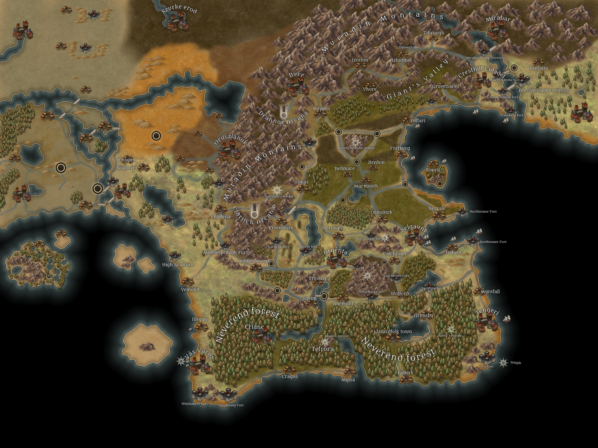

# Locane

Locane is a beautiful nation made predominantly from Human, Woodelfs, Montain Dwarfs, Halflings, Dragonborns. 
The wood elfs live in the south, living in and near the Neverend Forest, the dwarfs in the north, living in the Muradin Montains, humans are the predominant, living more in the big cities.

## Raças
1. Todos sabem que anões não se dão muito bem com elfos, principalmente os anões da montanha com os elfos da floresta. Por causa das antigas guerras entre eles, norte x sul. Inclusive existem 2 escolas de magia em Locane, uma mais ao norte e uma mais ao sul.
2. High elfs são mal vistos como os burgueses de locane. Pois a maioria foi embora para Lossenue na guerra e ficaram apenas a Elite, por isso muitos são 

## Historias
Selgaunt:
- Muros exteros e dos portos são muito grandes, impressionam as pessoas
- A cidade é banhada por agua banha em toda parte. Corregos de agua limpa passando entre montes por aquodutos de pedra branca.
- A cidade é bem militarizada, capital militar
- A cidade é bem arborizada, com arvores frutiferas por todo lado, para soldados ou pessoas passarem e pegar alguns frutos pra aproveitar a cidade
- Não existe preconceito, a cidade tem todas as raças passando indo e voltando por conta de ser entrada pro continente
- Atras da cidade, ao noroeste no alto de um monte, tem um enorme templo de Yondalla, um templo no centro da cidade para Kord.
- Falam que Sehanine, deusa da lua, faz Selgaunt ser mais iluminada fazendo a pedra branca que a cidade é esculpida refletir a luz.
- A cidade é Portuaria, ganha dinheiro assim.
- O comando da cidade é o comando militar da nação, todos sabem que a lider é Annastr.

Argenta:
